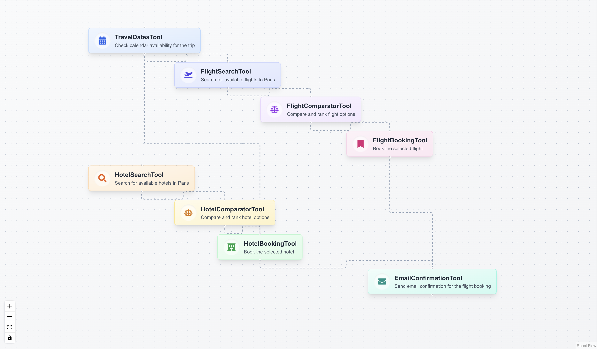

# Interactive Node Graph Visualization 🔄

A beautiful and interactive visualization tool for workflow processes, built with React Flow and TypeScript. This project provides a dynamic way to visualize complex workflows with dependencies and detailed step information.



## ✨ Features

- 🎯 Interactive node-based workflow visualization
- 🔄 Animated connections between dependent steps
- 💫 Smooth transitions and hover effects
- 📱 Responsive design
- 🎨 Custom styled nodes for different tool types
- 🔍 Detailed step information in an elegant drawer
- 🎮 Intuitive controls for navigation
- 🖼️ Beautiful gradients and modern UI design

## 🚀 Getting Started

### Prerequisites

- Node.js (v14 or higher)
- npm or yarn

### Installation

1. Clone the repository:

```bash
git clone https://github.com/luillyfe/planner-node-map.git
```

2. Install Dependencies

```bash
npm install
# or
yarn install
```

3. Run the development server

```bash
npm run dev
# or
yarn dev
```

4. Open http://localhost:3000 in your browser

## 🛠️ Built With

- React - Frontend framework
- TypeScript - Programming language
- React Flow - Node-based visualization library
- Tailwind CSS - Styling
- React Icons - Icon library

## 📦 Project Structure

```
src/
├── components/
│ ├── InteractiveNodeGraph.tsx # Main component
│ └── ui/ # UI components
├── types/ # TypeScript interfaces
└── styles/ # CSS styles
```

## 🎨 Customization

### Adding New Node Types

To add a new node type, update the getNodeStyle and getToolIcon functions:

```typescript
const getNodeStyle = (tool: string) => {
  const styles: { [key: string]: string } = {
    // Add new node style here
    NewTool: `${baseStyle} bg-gradient-to-br from-purple-50 to-purple-100 border-purple-200`,
  };
  return styles[tool] || baseStyle;
};

const getToolIcon = (tool: string) => {
  const icons: { [key: string]: JSX.Element } = {
    // Add new tool icon here
    NewTool: <NewIcon className="w-6 h-6 text-purple-600" />,
  };
  return icons[tool] || <FaSearch className="w-6 h-6" />;
};
```

### Modifying the Workflow

Update the planData object to modify the workflow:

```typescript
const planData: PlanData = {
  goal: "Your workflow goal",
  steps: [
    {
      description: "Step description",
      tool: "ToolName",
      parameters: {
        // Your parameters
      },
      dependencies: ["DependencyTool"],
    },
    // Add more steps...
  ],
};
```

## 🤝 Contributing

1. Fork the repository
2. Create your feature branch (git checkout -b feature/AmazingFeature)
3. Commit your changes (git commit -m 'Add some AmazingFeature')
4. Push to the branch (git push origin feature/AmazingFeature)
5. Open a Pull Request

## 📄 License

This project is licensed under the MIT License - see the LICENSE.md file for details

## 👏 Acknowledgments

- React Flow for the amazing visualization library
- Tailwind CSS for the utility-first CSS framework
- React Icons for the beautiful icons

## 📧 Contact

Fermin Blanco - @luillyfe - luillyfe89@gmail.com

Project Link: https://github.com/luillyfe/planner-node-map

---

Made with ❤️ by Fermin Blanco
